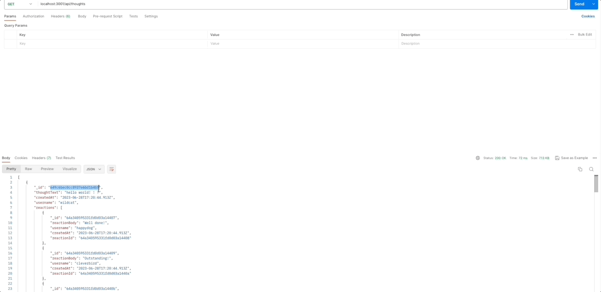
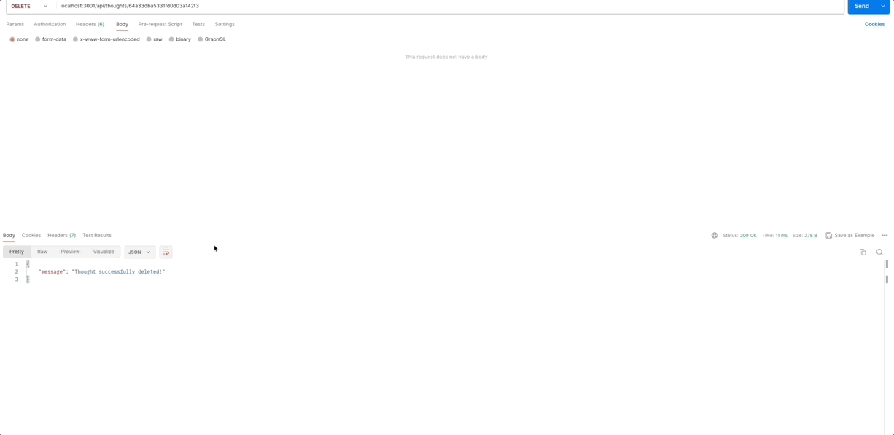
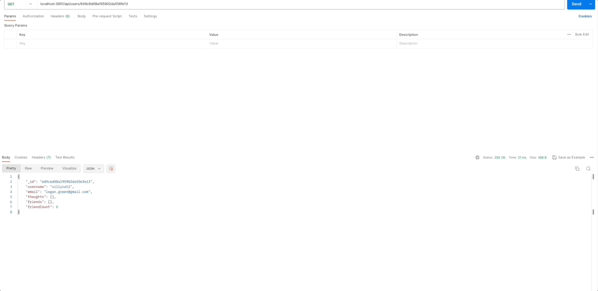

# social_butterfly

The Social Butterfly API is a robust backend application designed to power a social networking web application, leveraging Express.js for routing, MongoDB as the NoSQL database, and the Mongoose ODM for seamless data integration. With this API, users can share thoughts, react to friends' thoughts, and manage their friend list. MongoDB is chosen as the underlying database for its exceptional performance with large data volumes and flexibility in handling unstructured data. By launching the application and syncing the Mongoose models with the MongoDB database, you establish a solid foundation for your social network. The API provides comprehensive functionality, including GET routes for users and thoughts, delivering formatted JSON responses, as well as POST, PUT, and DELETE routes for user data and thoughts. Additionally, it supports POST and DELETE routes for reactions and friend management. To ensure clarity and validation, create a walkthrough video demonstrating the application's features and meeting the acceptance criteria, and include the video link in the README. By utilizing the Social Butterfly API, you empower users to express thoughts, engage with friends' content, and manage social connections effectively.

## Table of Contents

- [Installation](#installation)
- [Usage](#usage)
- [License](#license)

# Installation

Open the root path for the application in the integrated terminal and run `npm i` to install all the necesarry dependencies. Next you will initialize the database by running `npm run seed` To start the application, run `npm run start` or node server.js. Once the application is running, test the provided queries in Postman or Insomnia. Follow these steps to install the application, and then you can interact with it using the specified queries in Postman.

# Usage
The following gifs demonstrate the usage of Postman to test the routes and endpoints.

Github repository link: https://github.com/jackckendrick/social_butterfly

Youtube video Social Butterfly tutorial: https://youtu.be/SebIkALJOw0

# License

This project is using the MIT License.

# Badges

